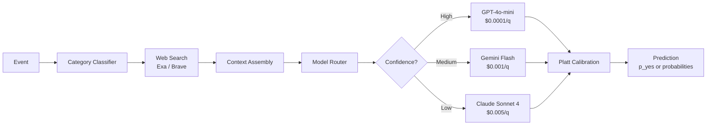

# 🔮 Sibyl

**Retrieval-augmented forecasting agent for Prophet Arena** — calibrated probability predictions with cost-tiered LLM routing.

> *Named after the ancient Greek prophetesses who channeled divine knowledge into actionable predictions.*

---

## What It Does

Sibyl is an AI forecasting agent that receives prediction market questions and returns **calibrated probability estimates**. It combines domain-specific web retrieval, market price anchoring, and multi-model LLM reasoning to outperform naive forecasting approaches.

### Core Pipeline

```
Event → Classify → Retrieve Context → Anchor on Market → Select Model → Reason → Calibrate → Predict
```



## Quick Start

```bash
# 1. Clone & install
git clone https://github.com/<your-username>/sibyl.git && cd sibyl
python -m venv .venv && source .venv/bin/activate
pip install -e ".[dev]"

# 2. Configure
cp .env.example .env
# Edit .env with your API keys

# 3. Run
uvicorn sibyl.server:app --port 8001
```

## API Endpoints

| Endpoint | Method | Description |
|---|---|---|
| `/chat/completions` | POST | OpenAI-compatible — Prophet Arena auto-eval |
| `/predict` | POST | CLI-compatible — `prophet forecast predict --agent-url` |
| `/health` | GET | Uptime monitoring |
| `/stats` | GET | Cost and performance metrics |

### Example: `/predict`

```bash
curl -X POST http://localhost:8001/predict \
  -H "Content-Type: application/json" \
  -H "Authorization: Bearer <token>" \
  -d '{
    "title": "Will the Fed raise rates in June 2026?",
    "outcomes": ["Yes", "No"],
    "category": "Economics"
  }'
```

Response:
```json
{
  "p_yes": 0.38,
  "rationale": "Recent CPI data shows cooling inflation, and FOMC minutes suggest a hold. Market consensus is 62% probability of no change."
}
```

## Architecture

### Cost-Tiered Model Selection

The agent routes each prediction to the cheapest suitable model:

| Confidence Level | Model | Cost | Use Case |
|---|---|---|---|
| **High** (>85%) | GPT-4o-mini | ~$0.0001/q | Clear consensus questions |
| **Medium** (15-85%) | Gemini 2.5 Flash | ~$0.001/q | Standard predictions |
| **Low** (40-60%) | Claude Sonnet 4 | ~$0.005/q | Close calls, complex reasoning |

**Estimated 2-week cost**: <$25 (well within $40 budget)

### Response Formats

Sibyl supports both Prophet Arena response formats:

**Binary events** (2 outcomes):
```json
{"p_yes": 0.65, "rationale": "..."}
```

**Multi-outcome events**:
```json
{"probabilities": [{"market": "A", "probability": 0.45}, {"market": "B", "probability": 0.35}, {"market": "C", "probability": 0.20}], "rationale": "..."}
```

### Category-Aware Retrieval

Events are classified into 6 categories, each with optimized search queries:

- **Sports** → Stats, odds, injury reports
- **Geopolitics** → News analysis, expert opinion
- **Economics** → Economic indicators, Fed signals
- **Science/Tech** → Research breakthroughs, announcements
- **Pop Culture** → Trends, social media sentiment
- **Other** → General analysis

## Project Structure

```
sibyl/
├── pyproject.toml
├── Dockerfile
├── .env.example
├── sibyl/
│   ├── server.py          # FastAPI dual-endpoint server
│   ├── agent.py           # Core prediction pipeline
│   ├── parser.py          # Event extraction from prompts
│   ├── classifier.py      # Category classification
│   ├── retrieval.py       # Web search (Exa/Brave)
│   ├── anchor.py          # Market price lookup
│   ├── reasoning.py       # LLM reasoning engine
│   ├── model_router.py    # Cost-tiered model selection
│   ├── calibration.py     # Platt scaling
│   ├── cache.py           # Disk-based response cache
│   └── config.py          # Environment settings
├── scripts/
│   ├── bench.py           # Brier score benchmarking
│   └── run_server.sh      # Launch script
└── tests/
    ├── test_server.py     # Endpoint tests
    ├── test_agent.py      # Pipeline tests
    ├── test_parser.py     # Parser tests
    └── test_classifier.py # Classifier tests
```

## Deployment

### Railway (Recommended)

```bash
# Deploy
railway up

# Set environment variables
railway variables set OPENAI_API_KEY=sk-... EXA_API_KEY=... BEARER_TOKEN=...

# Generate domain
railway domain
```

### Docker

```bash
docker build -t sibyl .
docker run -p 8001:8001 --env-file .env sibyl
```

## Testing

```bash
# Run all tests
pytest -v

# With coverage
pytest --cov=sibyl --cov-report=term-missing
```

## Tech Stack

| Layer | Technology |
|---|---|
| **Runtime** | Python 3.12 |
| **Framework** | FastAPI + Uvicorn |
| **LLM** | litellm (OpenAI, Anthropic, Google) |
| **Search** | Exa API, Brave Search |
| **Calibration** | scikit-learn (Platt scaling) |
| **Cache** | diskcache |
| **Deploy** | Railway / Docker |

## License

MIT — see [LICENSE](LICENSE).

---

*Built for [Prophet Hacks 2026](https://prophethacks.devpost.com/) — Forecasting Track*
