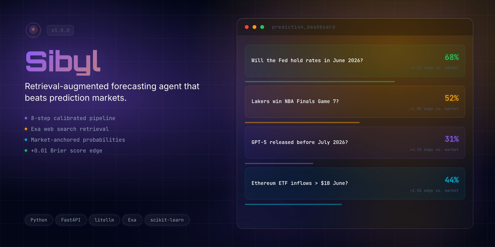

<div align="center">
  <h1>Sibyl 🔮</h1>
  <p><em>Retrieval-augmented forecasting agent for Prophet Arena — calibrated probability predictions with cost-tiered LLM routing.</em></p>
  

  <br/>

  [](https://github.com/edycutjong/sibyl)
  [](https://youtu.be/your-video)
  [](https://github.com/edycutjong/sibyl/pitch)
  [](https://prophethacks.devpost.com/)

  <br/>

  
  
  
  
  
  [](https://github.com/edycutjong/sibyl/actions/workflows/ci.yml)

</div>

---

## 📸 See it in Action

<div align="center">
  
</div>

> **Predict accurately and efficiently.** Event → Classify → Retrieve Context → Anchor on Market → Select Model → Reason → Calibrate → Predict.

---

## 💡 The Problem & Solution
Current forecasting models struggle with nuanced topics due to lack of real-time context and high computational costs for simple queries.
**Sibyl** solves this by using a cost-tiered LLM routing system that balances accuracy and efficiency, anchoring predictions on current market prices.

**Key Features:**
- ⚡ **Cost-Tiered Routing:** Routes predictions to the cheapest suitable model (GPT-4o-mini, Gemini Flash, Claude Sonnet) based on confidence.
- 🔒 **Category-Aware Retrieval:** Uses Exa and Brave for optimized search queries depending on the category.
- 🎨 **Calibrated Predictions:** Uses Platt scaling to return accurate probability estimates.

## 🏗️ Architecture & Tech Stack

| Layer | Technology |
|---|---|
| **Runtime** | Python 3.12 |
| **Framework** | FastAPI + Uvicorn |
| **LLM** | litellm (OpenAI, Anthropic, Google) |
| **Search** | Exa API, Brave Search |
| **Calibration** | scikit-learn (Platt scaling) |
| **Cache** | diskcache |
| **Deploy** | Railway / Docker |

## 🏆 Sponsor Tracks Targeted
- **Prophet Arena** — Agent implementation and forecasting performance.
- **OpenAI** — Utilizing GPT-4o-mini for efficient predictions.

## 🚀 Getting Started

### Prerequisites
- Python ≥ 3.12

### Installation
1. Clone: `git clone https://github.com/edycutjong/sibyl.git`
2. Configure: `cp .env.example .env` and add your keys
3. Install: `python -m venv .venv && source .venv/bin/activate && pip install -e ".[dev]"`
4. Run: `uvicorn sibyl.server:app --port 8001`


## 🧪 Testing & CI
```bash
ruff check .          # Linting
pytest --cov          # Run tests with coverage
```

## 📁 Project Structure
```
sibyl/
├── docs/              # README assets (hero, screenshots)
├── sibyl/             # Core prediction pipeline and server
│   ├── server.py      # FastAPI dual-endpoint server
│   ├── agent.py       # Core prediction pipeline
│   └── model_router.py# Cost-tiered model selection
├── tests/             # Pytest test suite
├── .env.example       # Environment template
├── .github/           # CI workflows
└── README.md          # You are here
```

## 📄 License
[MIT](LICENSE) © 2026 Edy Cu

## 🙏 Acknowledgments
Built for Prophet Hacks. Thank you to the sponsors for the APIs and tools.
