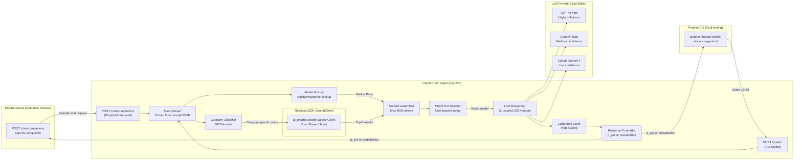

# OracleChain — Technical Architecture

## Tech Stack

| Layer | Technology | Rationale |
|---|---|---|
| **Runtime** | Python 3.12 | ai-prophet SDK is Python-native |
| **Web Framework** | FastAPI | OpenAI-compatible `/chat/completions` + `/predict` endpoints |
| **LLM Clients** | litellm | Unified interface for OpenAI, Anthropic, Google APIs |
| **Retrieval** | `ai_prophet.search.SearchClient` | **SDK built-in** — Exa, Brave, Tavily, Perplexity providers with sandbox mode |
| **Calibration** | scikit-learn | Platt scaling (LogisticRegression), isotonic regression |
| **Caching** | diskcache | Persistent cache for API responses, reduces cost |
| **Scheduling** | None (stateless) | Agent is invoked per-request by evaluation harness |
| **Deployment** | Railway / Fly.io | Always-on endpoint for 2-week eval window |
| **Testing** | pytest | Unit + integration tests |
| **Monitoring** | Logfire / simple logging | Track costs, latency, predictions |

## ⚠️ Critical: Endpoint Contract

The Prophet Arena evaluation harness calls your agent via an **OpenAI-compatible `POST /chat/completions`** endpoint — **NOT** a custom `/predict` route.

The harness sends event details as a chat prompt. Your agent must:
1. Parse the event from the prompt `messages[0].content`
2. Run your forecasting logic
3. Return an OpenAI-shaped response with `probabilities` JSON in the `content` field

## System Architecture



## Agent Contracts

### Contract A: OpenAI-Compatible Endpoint (Prophet Arena auto-eval)

```json
// Request from Prophet Arena
{"model": "oraclechain-v1", "messages": [{"role": "user", "content": "<prompt>"}]}

// Response: probabilities embedded in content string
{"choices": [{"message": {"content": "{\"probabilities\": [{\"market\": \"Cleveland\", \"probability\": 0.68}, {\"market\": \"Detroit\", \"probability\": 0.32}], \"rationale\": \"...\"}"}]}]
```

### Contract B: `/predict` Endpoint (CLI `--agent-url` testing)

```json
// Request: raw event JSON
{"event_ticker": "...", "market_ticker": "...", "title": "...", "outcomes": ["A", "B"]}

// Response: EITHER format
{"p_yes": 0.68, "rationale": "..."}  // binary
// OR
{"probabilities": [{"market": "A", "probability": 0.68}, {"market": "B", "probability": 0.32}]}
```

### Contract C: Local Module (CLI `--local` testing)
```python
# oraclechain/agent.py
def predict(event: dict) -> dict:
    """
    CLI-compatible entry point. Used with:
      prophet forecast predict --local oraclechain.agent --events events.json

    Returns EITHER:
      {"p_yes": 0.68, "rationale": "..."}  # binary
    OR:
      {"probabilities": [{"market": "A", "probability": 0.68}, ...], "rationale": "..."}
    """
```

## Project Structure
```
oraclechain/
├── pyproject.toml            # Dependencies
├── README.md
├── ARCHITECTURE.md           # This document
├── .env.example              # Required API keys
├── oraclechain/
│   ├── __init__.py
│   ├── agent.py              # Core predict() function (CLI-compatible, dual format)
│   ├── server.py             # FastAPI: /chat/completions (OpenAI) + /predict (CLI)
│   ├── parser.py             # Extract event JSON from chat prompt
│   ├── classifier.py         # Category classifier (GPT-4o-mini)
│   ├── anchor.py             # Market price lookup
│   ├── retrieval.py          # Uses SDK SearchClient (exa/brave/tavily/perplexity)
│   ├── reasoning.py          # LLM reasoning + structured output
│   ├── calibration.py        # Platt scaling calibration layer
│   ├── model_router.py       # Cost-tiered model selection
│   ├── cache.py              # Disk-based response cache
│   └── config.py             # Settings + API keys
├── scripts/
│   ├── bench.py              # Brier score benchmark (uses sample-resolved)
│   ├── calibrate.py          # Train calibration model
│   ├── seed.py               # Seed historical data
│   └── run_server.sh         # Launch endpoint
├── tests/
│   ├── test_server.py        # Both endpoints (OpenAI-compat + /predict)
│   ├── test_parser.py        # Event extraction from prompts
│   ├── test_classifier.py
│   ├── test_retrieval.py     # SearchClient integration
│   ├── test_reasoning.py
│   ├── test_calibration.py
│   └── test_agent.py
├── data/
│   └── fixtures/
│       ├── sample_events.json    # Retrieved via `prophet forecast retrieve`
│       ├── resolved_events.json  # Retrieved via `prophet forecast retrieve --dataset sample-resolved`
│       └── calibration_data.csv  # Historical predictions for calibration
└── Dockerfile                # For deployment
```

## Database Schema

No database needed. This is a stateless agent:
- **Cache**: diskcache (file-based, ephemeral)
- **Calibration model**: Pickled scikit-learn model (trained offline, loaded at startup)
- **Logs**: File-based or cloud logging

## HTTP Endpoints

| Endpoint | Method | Description |
|---|---|---|
| `POST /chat/completions` | POST | **OpenAI-compatible** — Prophet Arena auto-eval endpoint |
| `POST /predict` | POST | **CLI-compatible** — for `prophet forecast predict --agent-url` |
| `GET /health` | GET | Health check for uptime monitoring |
| `GET /stats` | GET | Cost tracker, prediction count, avg latency |

## Key Libraries

| Library | Purpose |
|---|---|
| `ai-prophet-core` | Official SDK — Event schemas, Prediction models, CLI integration |
| `ai-prophet` | CLI — `prophet forecast retrieve/predict/evaluate/submit/leaderboard` |
| `ai_prophet.search` | **SDK SearchClient** — Exa, Brave, Tavily, Perplexity |
| `litellm` | Unified LLM API (OpenAI, Anthropic, Google) |
| `fastapi` + `uvicorn` | HTTP server (dual endpoints) |
| `scikit-learn` | Calibration (Platt scaling) |
| `diskcache` | Persistent response cache |
| `pydantic` | Request/response validation |
| `python-dotenv` | Environment variable management |

## Model Selection with Domain Justification

| Model | Use Case | Justification |
|---|---|---|
| **GPT-4o-mini** | Category classification, high-confidence predictions | Cheapest frontier model; classification doesn't need deep reasoning |
| **Gemini 2.5 Flash** | Medium-confidence predictions with retrieved context | Best cost-to-performance ratio for context-heavy reasoning |
| **Claude Sonnet 4** | Close-call predictions (market 40-60%) | Best calibration and reasoning on ambiguous questions per Prophet Arena leaderboard |

**Why not one model?** The leaderboard shows model-context interaction matters. GPT-4o-mini on a 90% confidence sports question wastes $0.005/call when it can be done for $0.0001.

## Deployment Target

**Railway** (preferred) or **Fly.io**:
- Always-on container for 2-week evaluation
- Auto-restart on crash
- Environment variable management for API keys
- Onboarding at `prophetarena.co/onboarding` — submit endpoint URL + model name + bearer token
- Estimated hosting cost: ~$5/month

## Boilerplate Recommendation

Start from the `ai-prophet/example-api` pattern:
```bash
mkdir oraclechain && cd oraclechain
python -m venv .venv && source .venv/bin/activate
pip install ai-prophet-core ai-prophet litellm fastapi uvicorn httpx beautifulsoup4 scikit-learn diskcache pydantic python-dotenv
```

Reference: https://github.com/ai-prophet/example-api (verified working endpoint)
