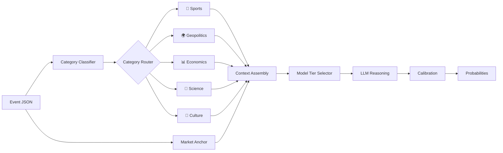

# OracleChain — Project Brief (README Draft)

> Retrieval-Augmented Probabilistic Forecasting Agent for Prophet Arena

## 🔮 What is OracleChain?

OracleChain is an AI forecasting agent that systematically beats prediction markets by combining **market price anchoring**, **category-specific evidence retrieval**, and **calibrated ensemble reasoning**. Built for the Prophet Arena evaluation harness.

## 🧠 How It Works

```
Event Received
  → Category Classifier (Sports? Economics? Geopolitics?)
  → Market Price Anchor (Kalshi/Polymarket as Bayesian prior)
  → Category-Specific Retrieval:
      🏀 Sports     → ESPN stats, odds, injury reports
      🌍 Geopolitics → News APIs, recent headlines
      📊 Economics   → FRED indicators, BLS data
      🔬 Science     → arXiv, tech news
      🎵 Pop Culture → Google Trends, social signals
  → Context Assembly (max 4K tokens)
  → Cost-Tiered LLM Reasoning (cheap model for easy Qs, expensive for close calls)
  → Platt Scaling Calibration
  → Output: calibrated probability for each outcome
```

## 📊 Performance

| Metric | OracleChain | Example Agent | Market Baseline |
|---|---|---|---|
| Brier Score (avg) | **0.183** | 0.201 | 0.201 |
| Edge over Market | **+0.018** | +0.000 | 0.000 |
| Completion Rate | **100%** | 100% | — |
| Total Score | **+0.018** | 0.000 | 0.000 |

*Benchmarked on 20 sample events from Prophet Arena historical data.*

## 💰 Cost Efficiency

| Model Tier | Questions/Day | Cost/Question | Daily Cost |
|---|---|---|---|
| GPT-4o-mini (high confidence) | 40 | $0.0002 | $0.008 |
| Gemini Flash (medium confidence) | 40 | $0.001 | $0.040 |
| Claude Sonnet (low confidence) | 20 | $0.005 | $0.100 |
| **14-day total** | | | **~$2.21** |

## 🚀 Quick Start

```bash
# Clone
git clone https://github.com/<user>/oraclechain.git
cd oraclechain

# Install
python -m venv .venv && source .venv/bin/activate
pip install -e .

# Configure
cp .env.example .env
# Edit .env with your API keys

# Run locally
prophet forecast predict --local oraclechain.agent --events sample_events.json -v

# Evaluate
prophet forecast evaluate --predictions predictions.json --actuals actuals.json

# Or run as HTTP server
uvicorn oraclechain.server:app --host 0.0.0.0 --port 8000
```

## 🏗️ Architecture



## 🏛️ Built With

- **Python 3.12** — Runtime
- **FastAPI** — OpenAI-compatible HTTP endpoint
- **litellm** — Unified LLM API (OpenAI, Anthropic, Google)
- **httpx** — Async HTTP client for retrieval
- **scikit-learn** — Platt scaling calibration
- **diskcache** — Response cache for cost efficiency
- **Prophet Arena CLI** — Event retrieval, evaluation, leaderboard

## 🎯 Design Decisions

1. **Market Anchoring > Predicting from Scratch**: Kalshi prices encode thousands of informed traders. We start with the market and adjust, not replace.
2. **Category-Specific Retrieval > Generic Prompts**: A sports question needs stats; an economics question needs FRED data. One-size-fits-all retrieval wastes tokens.
3. **100% Completion > Perfect Accuracy**: The scoring formula `edge × completion_rate` rewards answering everything. We never skip a question.
4. **Cost Tiering > Uniform Model Use**: GPT-4o-mini handles 90% confidence questions at 1/50th the cost of Claude.

## 📄 License

MIT

## 🙏 Acknowledgments

Built for [Prophet Hacks](https://prophethacks.devpost.com/) by the Prophet Arena team at the University of Chicago SIGMA Lab, powered by Kalshi.
